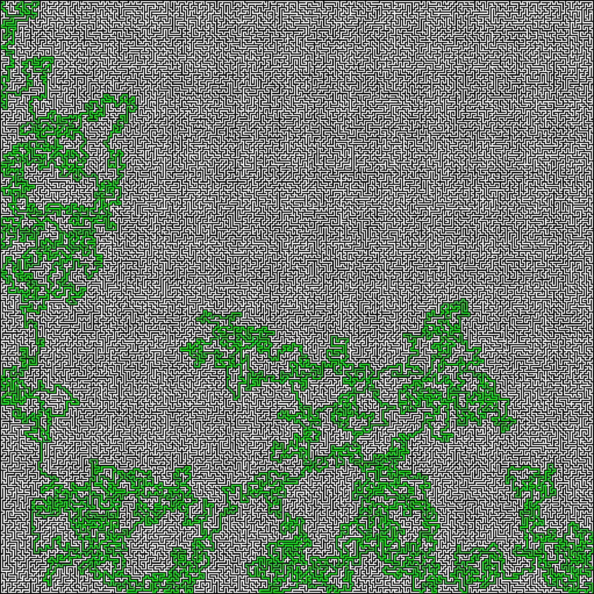

# maze-game
This is still in development!  
Current Progress:  
A 15-by-15 Maze:  

A 255-by-255 Maze:  


## How To Run
To compile this project you need to be in the src folder, and run:

``` 

g++ main.cpp -O2 -march=native -o main.exe

```

And to run it you just need to determine the dimensions of the maze:

```

./main.exe mazeDimension

```
Please put in mind that you can't input less than `1` or more than `255` (arbitraty constrain)

## Design Choices
I chose to use a randomized DFS & backtracking approach for maze generations  
and the A* fucntion for maze solving.  
I chose both functions for their simplicity and efficiency, because maze generation / solving is not the main scope of this project.  
I also included a helper function that makes a PPM images that generates images of the mazes.

## The Project's Scope
I'm aiming to make a 3D game-like setup for this project using WASM and JS, currently, I'm polishing the maze generation & solving code.

## Tests
I have included many tests:  
-Tests for variables  
-Tests using a seedded pre-generated maze from a working version to compare against to know if the generation failed  
-Tests for invalid inputs  
-Tests for valid mazes (by solving them)  
-Tests for the maze solver  
To run the test:  

```

g++ testing.cpp -O2 -march=native -lgtest -pthread -o test.exe
./test.exe

```