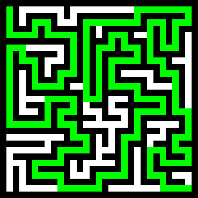
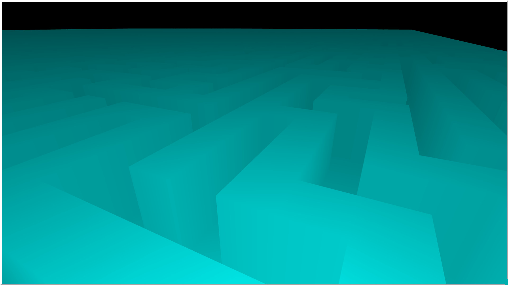

# maze-game

To try the game go to [this website](https://eyad-jawad.github.io/maze-game/game/website), press `Enter` to generate a maze, you can move using `arrow` keys or `WSAD` keys, and use the `mouse` lock the screen to turn the player.
Current Progress:
A 10-by-10 3D Maze:

A 15-by-15 Maze:

A 100-by-100 3D Maze:

A 255-by-255 Maze:


## How To Run

To compile this project you need to be in the src folder, and run:

```

g++ main.cpp -O2 -march=native -o main.exe

```

And to run it you just need to determine the dimensions of the maze:

```

./main.exe mazeDimension

```

Please put in mind that you can't input less than `1` or more than `255` (arbitrary constrain)

## Design Choices

I chose to use a randomized DFS & backtracking approach for maze generation
and the A* function for maze solving.
I chose both functions for their simplicity and efficiency, because maze generation / solving is not the main scope of this project.
I also included a helper function that makes PPM images that generates images of the mazes.
I used WebGL and JavaScript for the gameplay to enhance my skills in JavaScript, I also did the rendering, movement system, camera system, game system, and everything in between myself, without any dependencies except for gl-matrix for 4-by-4 matrices and 3D vectors.

## The Project's Scope

Right now the project is conceptually done, adding more features or smoothing out the edges is not within my goals.
This project has been a tremendous experience for me JavaScript-wise, however, I intend to move out to other projects, I think this project is perfect as is, front-end things are not the goal after all.

## Benchmarks

It takes `15 ms` to generate and solve a 255-by-255 maze (the maximum size)
Or it takes `150 ms` to generate and solve 10 255-by-255 mazes, on my machine.

## Tests

I have included many tests:
-Tests for variables
-Tests using a seeded pre-generated maze from a working version to compare against to know if the generation failed
-Tests for invalid inputs
-Tests for valid mazes (by solving them)
-Tests for the maze solver
To run the test, you must first install the GTest dependency, and then run:

```

g++ testing.cpp -O2 -march=native -lgtest -pthread -o test.exe
./test.exe

```

I also tested it with Valgrind, there were `0` errors, and `0` leaks, to test for valgrind:

```

valgrind \
    --leak-check=full \
    --show-leak-kinds=all \
    --track-origins=yes \
    --verbose \
    --log-file=valgrind-out.txt \
    ./test.exe # Put the file name here

```  

To test the JavaScript code you need to first install the JS dependencies using `npm install`, then run `npm test` to run the tests (NOT FULL JS COVERAGE YET).

## WASM

To compile the code to WASM or JS run this:

```

emcc wasmLayer.cpp \
    -Imaze -O3 \
    -o ./maze.js \
    -s MODULARIZE=1 \
    -s EXPORT_ES6=1 \
    -sNO_DISABLE_EXCEPTION_CATCHING \
    -s EXPORTED_FUNCTIONS="['_run','_size', '_setSeed']" \
    -s EXPORTED_RUNTIME_METHODS="['HEAPU8']"

```

However, know that you must have emscripten installed on your computer.  