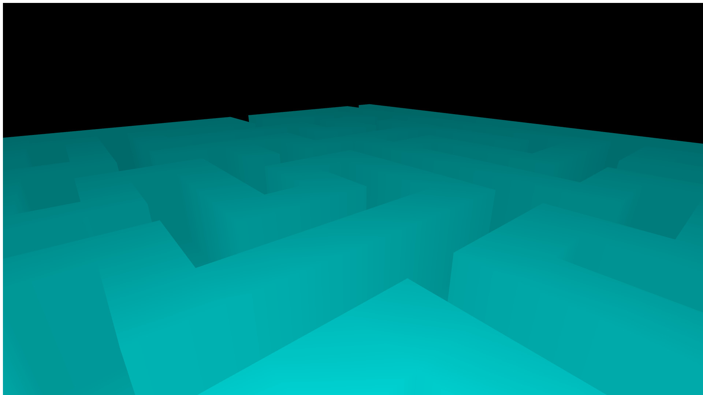

# maze-game
This is still in development!  
Current Progress:  
A 10-by-10 3D Maze:  
  
A 15-by-15 Maze:  
  
A 100-by-100 3D Maze:  
  
A 255-by-255 Maze:  
  

## How To Run
To compile this project you need to be in the src folder, and run:

``` 

g++ main.cpp -O2 -march=native -o main.exe

```

And to run it you just need to determine the dimensions of the maze:

```

./main.exe mazeDimension

```
Please put in mind that you can't input less than `1` or more than `255` (arbitraty constrain)

## Design Choices
I chose to use a randomized DFS & backtracking approach for maze generations  
and the A* fucntion for maze solving.  
I chose both functions for their simplicity and efficiency, because maze generation / solving is not the main scope of this project.  
I also included a helper function that makes a PPM images that generates images of the mazes.

## The Project's Scope
Right now the project is conceptually done, adding more features or smoothing out the edges is not within my goals.  
To try the game go to [this website](https://eyad-jawad.github.io/maze-game/game/), press `Enter` to generate a maze, and move freely a as you wish.

## Benchmarks
It takes `15 ms` to generate and solve a 255-by-255 maze (the maximum size)  
Or it takes `150 ms` to generate and solve 10 255-by-255 mazes, on my machine.  


## Tests
I have included many tests:  
-Tests for variables  
-Tests using a seeded pre-generated maze from a working version to compare against to know if the generation failed  
-Tests for invalid inputs  
-Tests for valid mazes (by solving them)  
-Tests for the maze solver  
To run the test, you must first install the GTest dependency, and then run:  

```

g++ testing.cpp -O2 -march=native -lgtest -pthread -o test.exe
./test.exe

```
I also tested it with Valgrind, there were `0` errors, and `0` leaks.

## WASM
To compile the code to WASM or JS run this inside project folder:

```

emcc game/wasmLayer.cpp \
-Imaze -O3 \
-o game/maze.js \
-s MODULARIZE=1 \
-s EXPORT_ES6=1 \
-s EXPORTED_FUNCTIONS="['_run','_size']" \
-s EXPORTED_RUNTIME_METHODS="['HEAPU8']"

```
however, know that you must have emscripten installed on your computer.